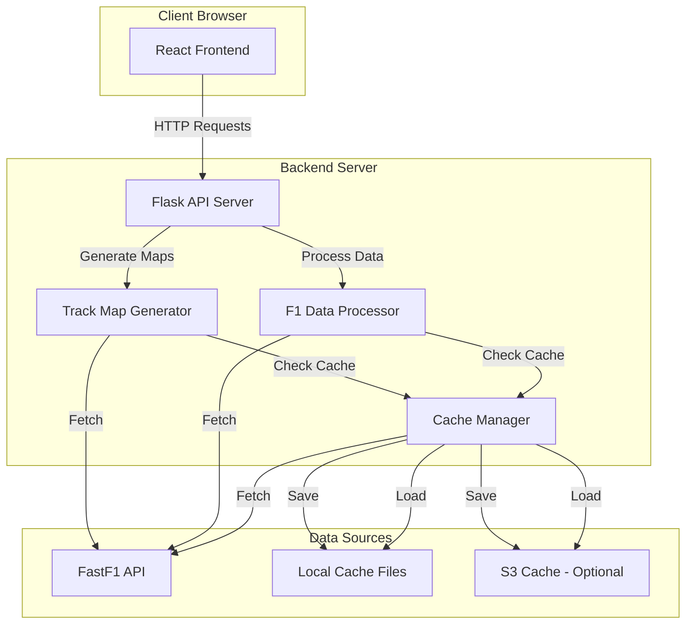
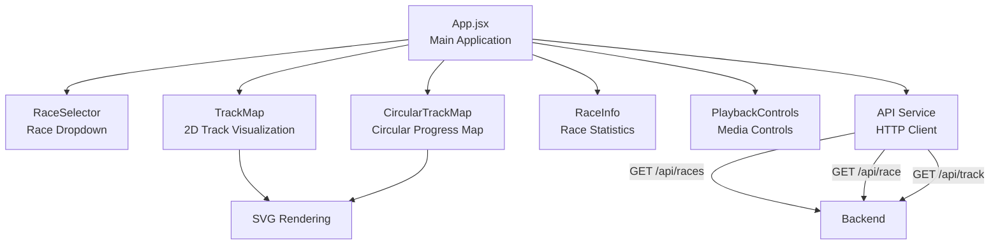
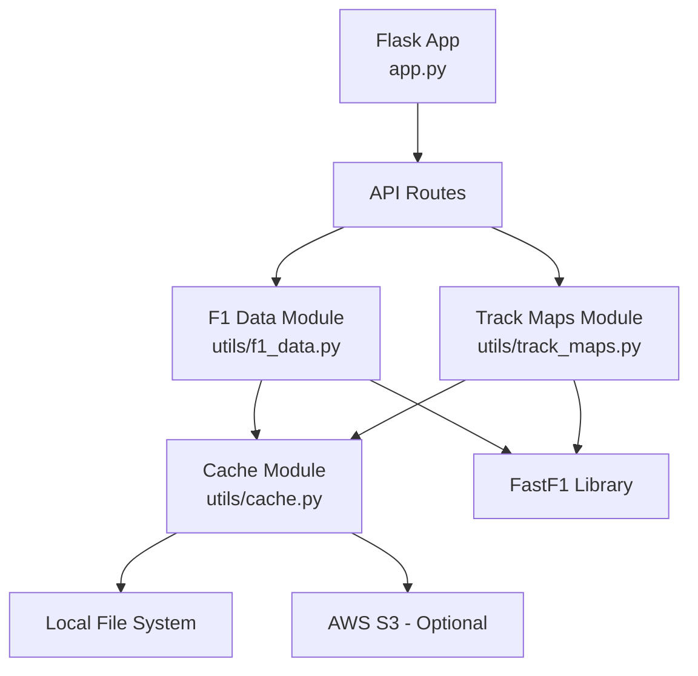
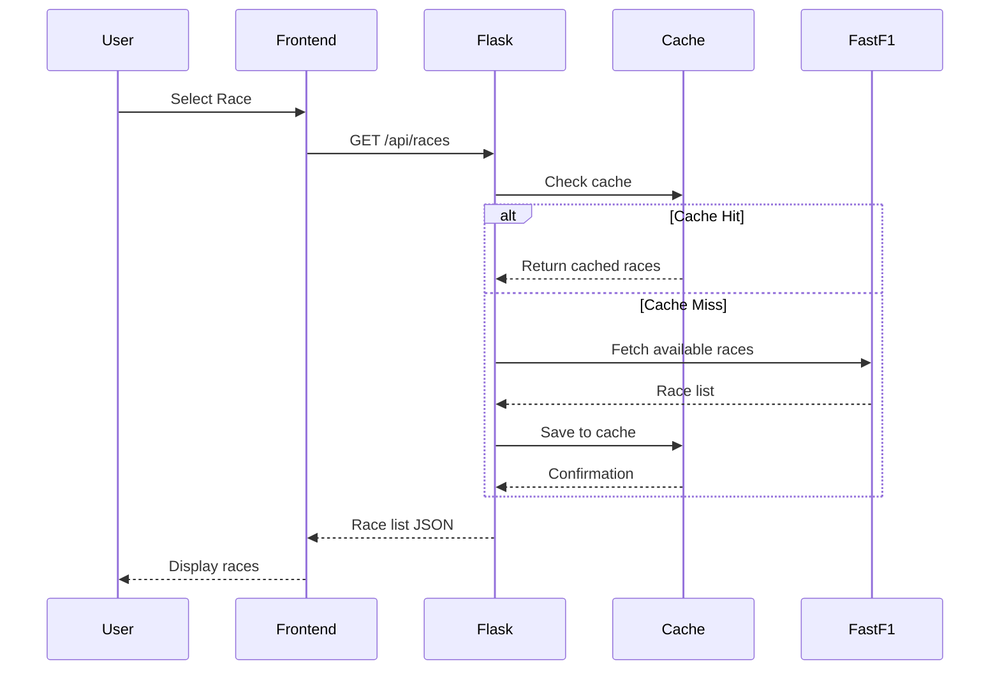
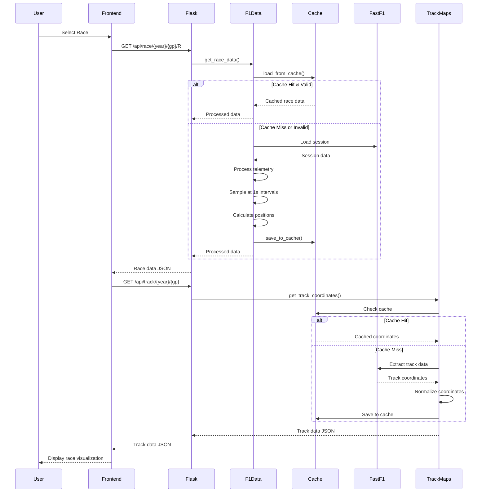
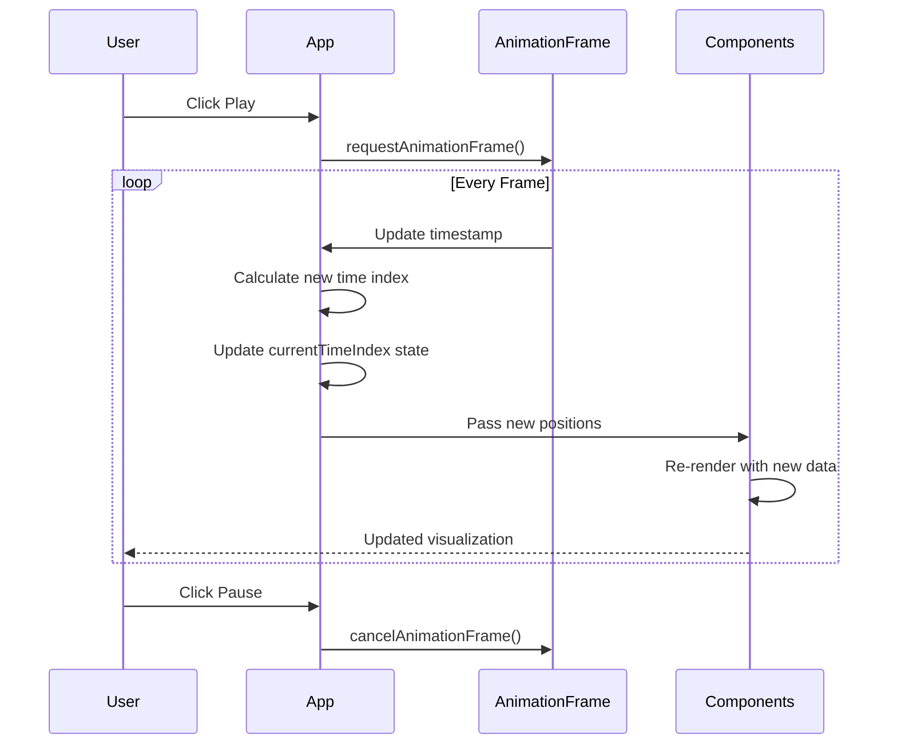
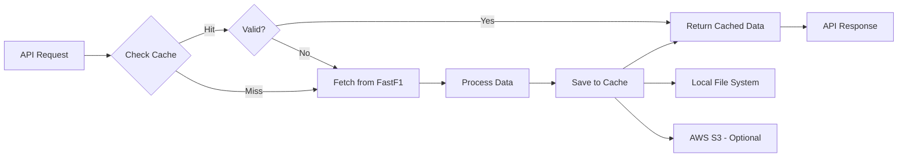
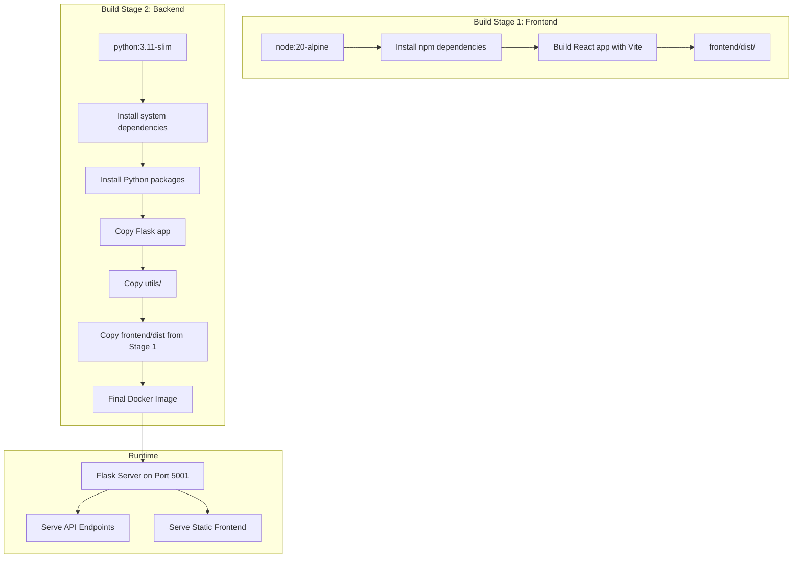

# F1 Race Replay Application - Architecture Documentation

## Table of Contents
1. [Overview](#overview)
2. [System Architecture](#system-architecture)
3. [Component Architecture](#component-architecture)
4. [Data Flow](#data-flow)
5. [API Endpoints](#api-endpoints)
6. [Caching Strategy](#caching-strategy)
7. [Deployment](#deployment)
8. [Key Technologies](#key-technologies)

---

## Overview

The F1 Race Replay Application is a full-stack web application that allows users to replay Formula 1 races with interactive visualizations. The application fetches race telemetry data from FastF1, processes it, and displays it in real-time with interactive track maps showing driver positions.

### Key Features
- **Race Selection**: Browse and select from available 2025 F1 races
- **Interactive Track Maps**: Two visualization modes (2D track map and circular progress map)
- **Playback Controls**: Play, pause, fast-forward, rewind, and timeline scrubbing
- **Real-time Position Updates**: Driver positions update as the race replay progresses
- **Race Information**: Current lap, top 3 positions, and fastest lap tracking
- **Dark Mode UI**: Modern dark theme interface

---

## System Architecture

### High-Level Architecture



### Technology Stack

**Frontend:**
- React 18.2+ (UI framework)
- Vite (build tool and dev server)
- Axios (HTTP client)
- SVG (track visualizations)

**Backend:**
- Python 3.11
- Flask (web framework)
- FastF1 (F1 data library)
- Pandas (data processing)
- NumPy (numerical operations)

**Infrastructure:**
- Docker & Docker Compose (containerization)
- Multi-stage Docker builds
- Optional S3 caching

---

## Component Architecture

### Frontend Components



#### Component Responsibilities

**App.jsx** - Main application component
- Manages global state (selected race, race data, track data, playback state)
- Coordinates data fetching and component updates
- Handles playback animation using `requestAnimationFrame`
- Manages playback controls (play/pause, speed, seeking)

**RaceSelector.jsx** - Race selection dropdown
- Displays list of available races
- Handles race selection
- Shows loading state

**TrackMap.jsx** - 2D track visualization
- Renders track layout as SVG path
- Displays driver positions as colored circles
- Updates positions based on current time index
- Handles coordinate transformation and scaling

**CircularTrackMap.jsx** - Circular progress visualization
- Shows track as a circle with progress markers
- Displays driver positions around the circle
- Shows lap progress (0%, 25%, 50%, 75%, 100%)
- Calculates position based on distance along track

**RaceInfo.jsx** - Race information panel
- Displays current lap number
- Shows top 3 positions
- Calculates and displays fastest lap
- Updates in real-time during playback

**PlaybackControls.jsx** - Media controls
- Play/pause button
- Fast-forward (1x, 2x, 4x, 8x speeds)
- Rewind (10 seconds)
- Timeline slider for seeking
- Time display (current/total)

### Backend Components



#### Module Responsibilities

**app.py** - Flask application
- Defines API endpoints
- Serves static frontend files in production
- Handles CORS for development
- Error handling and response formatting

**utils/f1_data.py** - Race data processing
- Fetches race sessions from FastF1
- Processes telemetry data for all drivers
- Samples data at 1-second intervals
- Calculates driver positions, lap numbers, distances
- Formats time data (relative to race start)
- Extracts driver information (names, teams, colors)
- Calculates total laps and lap times

**utils/track_maps.py** - Track coordinate extraction
- Extracts track coordinates from FastF1 session data
- Normalizes coordinates for consistent rendering
- Handles coordinate system transformations
- Calculates track bounds and scaling factors

**utils/cache.py** - Caching system
- Manages local file-based cache
- Optional S3 integration for distributed caching
- Cache validation (30-day expiration)
- Cache key generation and file management

---

## Data Flow

### Race Selection Flow



### Race Data Loading Flow



### Playback Flow



---

## API Endpoints

### GET /api/races
Returns a list of available races for the 2025 season.

**Response:**
```json
[
  {
    "year": 2025,
    "gp": "Monaco",
    "name": "Monaco Grand Prix",
    "date": "2025-05-25"
  },
  ...
]
```

**Caching:** 30 days

### GET /api/race/{year}/{gp}/{session}
Returns processed race telemetry data.

**Parameters:**
- `year`: Race year (e.g., 2025)
- `gp`: Grand Prix name (e.g., "Monaco")
- `session`: Session type (typically "R" for Race)

**Response:**
```json
{
  "year": 2025,
  "gp": "Monaco",
  "session": "R",
  "drivers": {
    "VER": {
      "name": "Max Verstappen",
      "team": "Red Bull Racing",
      "color": "#1E41FF"
    },
    ...
  },
  "telemetry": [
    {
      "time": "0:00:00",
      "drivers": {
        "VER": {
          "x": 1234.5,
          "y": 5678.9,
          "distance": 0.0,
          "speed": 0.0,
          "lap": 1
        },
        ...
      }
    },
    ...
  ],
  "total_duration": "1:45:23",
  "track_length": 3337.0,
  "total_laps": 78,
  "lap_times": {
    "VER": {
      "1": 89.123,
      "2": 88.456,
      ...
    },
    ...
  }
}
```

**Processing:**
- Samples telemetry at 1-second intervals
- Converts absolute timestamps to relative times (from race start)
- Includes driver positions (X, Y coordinates, distance, speed, lap number)
- Calculates total laps and lap times for fastest lap tracking

**Caching:** 30 days

### GET /api/track/{year}/{gp}
Returns normalized track coordinates for visualization.

**Parameters:**
- `year`: Race year
- `gp`: Grand Prix name

**Response:**
```json
{
  "path": [
    {"x": -0.5, "y": 0.3},
    {"x": -0.4, "y": 0.35},
    ...
  ],
  "bounds": {
    "minX": -100.0,
    "maxX": 100.0,
    "minY": -50.0,
    "maxY": 50.0
  },
  "center": {
    "x": 0.0,
    "y": 0.0
  },
  "scale": 200.0
}
```

**Processing:**
- Extracts track coordinates from FastF1 session data
- Normalizes coordinates to -1 to 1 range
- Inverts X-axis for correct orientation
- Calculates center and scale for frontend rendering

**Caching:** 30 days

---

## Caching Strategy

### Cache Architecture



### Cache Layers

1. **FastF1 Cache** (`cache/` directory)
   - Raw FastF1 API responses
   - Managed by FastF1 library
   - Reduces API calls to official F1 data sources

2. **Processed Data Cache** (`data_cache/` directory)
   - Processed race telemetry data
   - Normalized track coordinates
   - JSON format for quick loading
   - 30-day expiration

3. **Optional S3 Cache**
   - Distributed caching for production
   - Requires AWS credentials
   - Falls back to local cache if unavailable

### Cache Invalidation

- **Time-based**: 30-day expiration for all cached data
- **Format-based**: Detects old cache formats and regenerates
- **Manual**: Can clear cache via file deletion

### Cache File Structure

```
data_cache/
├── available_races.json
├── 2025_Monaco_R.json
├── 2025_Monaco_track.json
├── 2025_Bahrain_R.json
└── ...
```

---

## Deployment

### Docker Architecture



### Docker Compose Configuration

- **Service**: `f1-timing`
- **Port**: 5001 (mapped to host)
- **Volumes**: 
  - `./cache` → `/app/cache` (FastF1 cache)
  - `./data_cache` → `/app/data_cache` (processed data cache)
- **Environment**: Production mode

### Build Process

1. **Stage 1 (Frontend Builder)**:
   - Uses Node.js 20 Alpine image
   - Installs npm dependencies
   - Builds React app with Vite
   - Outputs to `frontend/dist/`

2. **Stage 2 (Python Runtime)**:
   - Uses Python 3.11 slim image
   - Installs system dependencies (gcc for some packages)
   - Installs Python packages from `requirements.txt`
   - Copies Flask application and utilities
   - Copies built frontend from Stage 1
   - Sets up cache directories
   - Exposes port 5001

### Local Development

**Backend:**
```bash
python app.py  # Runs on port 5001
```

**Frontend:**
```bash
cd frontend
npm run dev  # Runs on port 3000, proxies API to 5001
```

**Production (Docker):**
```bash
docker compose up --build -d
# Access at http://localhost:5001
```

---

## Key Technologies

### FastF1 Library

FastF1 is a Python library that provides access to Formula 1 timing data, telemetry, and session information. The application uses it to:

- Fetch race session data
- Extract driver telemetry (position, speed, distance, lap number)
- Get track coordinates
- Access driver and team information
- Calculate lap times

### Data Processing Pipeline

1. **Session Loading**: Loads race session from FastF1
2. **Telemetry Extraction**: Gets telemetry for all drivers
3. **Time Normalization**: Converts absolute timestamps to relative times
4. **Sampling**: Samples data at 1-second intervals for performance
5. **Position Calculation**: Extracts X, Y coordinates, distance, speed, lap number
6. **Formatting**: Converts to JSON format for API response

### Frontend Rendering

**Track Map Rendering:**
- Uses SVG for scalable vector graphics
- Transforms normalized coordinates to viewBox coordinates
- Renders track as SVG path
- Displays drivers as colored circles with labels
- Updates positions on each animation frame

**Circular Map Rendering:**
- Calculates driver progress as percentage of lap
- Converts progress to angle (0% = 12 o'clock, 25% = 3 o'clock, etc.)
- Renders track as circle with progress markers
- Displays drivers around the circle perimeter

**Playback Animation:**
- Uses `requestAnimationFrame` for smooth 60fps updates
- Calculates time index based on playback speed
- Updates all components on each frame
- Handles seeking and scrubbing via timeline slider

---

## Performance Considerations

### Optimization Strategies

1. **Data Sampling**: Telemetry sampled at 1-second intervals (vs. 10Hz raw data)
2. **Caching**: Aggressive caching reduces FastF1 API calls
3. **Lazy Loading**: Race data only loaded when selected
4. **SVG Rendering**: Efficient vector graphics rendering
5. **Animation Frame**: Uses browser's optimized animation API

### Scalability

- **Horizontal Scaling**: Stateless API allows multiple instances
- **Caching**: Reduces backend load significantly
- **Static Assets**: Frontend served as static files (CDN-ready)
- **Optional S3**: Distributed caching for multi-instance deployments

---

## Future Enhancements

Potential improvements and features:

- **Multi-Year Support**: Extend beyond 2025 season
- **Safety Car Visualization**: Show safety car periods
- **Lap-by-Lap Navigation**: Jump to specific laps
- **Driver Tooltips**: Hover for detailed driver information
- **Speed Visualization**: Color-code drivers by speed
- **Comparison Mode**: Compare multiple races side-by-side
- **Export Functionality**: Export race data or screenshots
- **Real-time Updates**: WebSocket support for live race data

---

## Conclusion

The F1 Race Replay Application demonstrates a modern full-stack architecture with:

- **Separation of Concerns**: Clear frontend/backend separation
- **Efficient Data Processing**: Optimized telemetry sampling and caching
- **Interactive Visualizations**: Multiple visualization modes
- **Performance Optimization**: Caching, sampling, and efficient rendering
- **Containerization**: Docker-based deployment for consistency
- **Extensibility**: Modular design allows for future enhancements

The architecture supports both development flexibility and production scalability, making it suitable for personal use or potential expansion to a larger platform.

